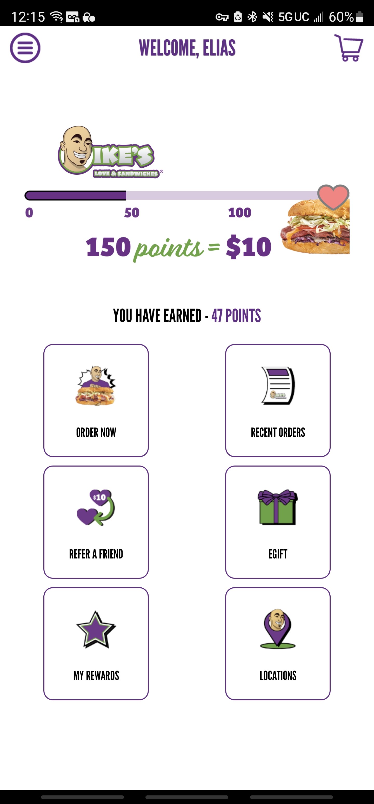
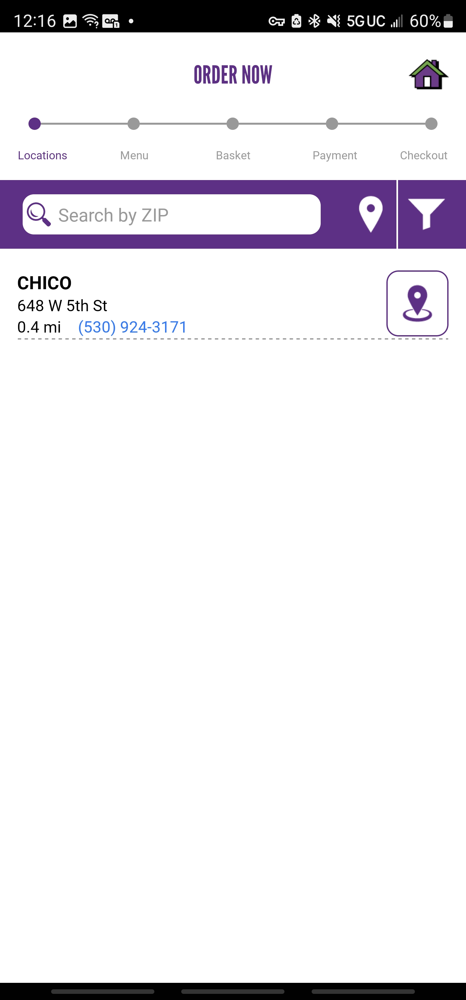
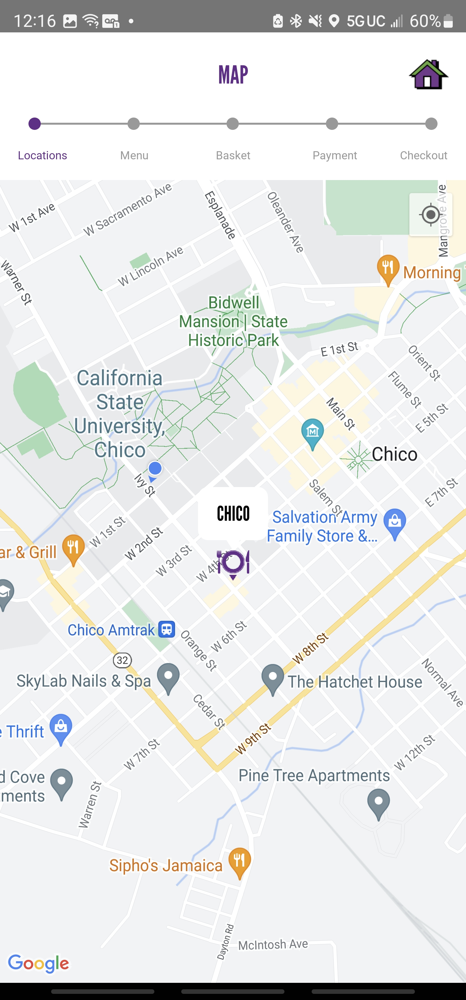
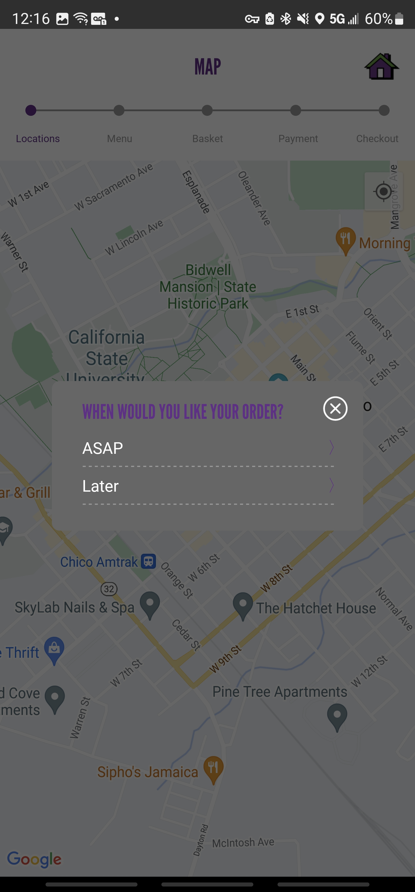

# First Journal Entry...
When I want a sandwich I usually order from Ike’s, to expedite the ordering and retrieval of my sandwich I order using their app. With other mobile ordering apps usually your device's location is used to find the nearest location of an establishment. When I first used the application instead of using my location I had to manually type out my location to find the nearest Ike’s location, this did not follow my expectations. After the initial set up I still have to click through 3 different screens to start my order.

Then after I have my order ready, only sometimes does it take you to the basket/cart to complete the order. Navigating there requires you to go back to the home screen and the you have to click the cart icon. Overall it is frustrating and not very learnable. My mental model built up by using other food ordering apps did not match my experience with the app. Despite my frustrations there were no errors. I don’t order online using the app anymore because of the difficulty with ordering. 
