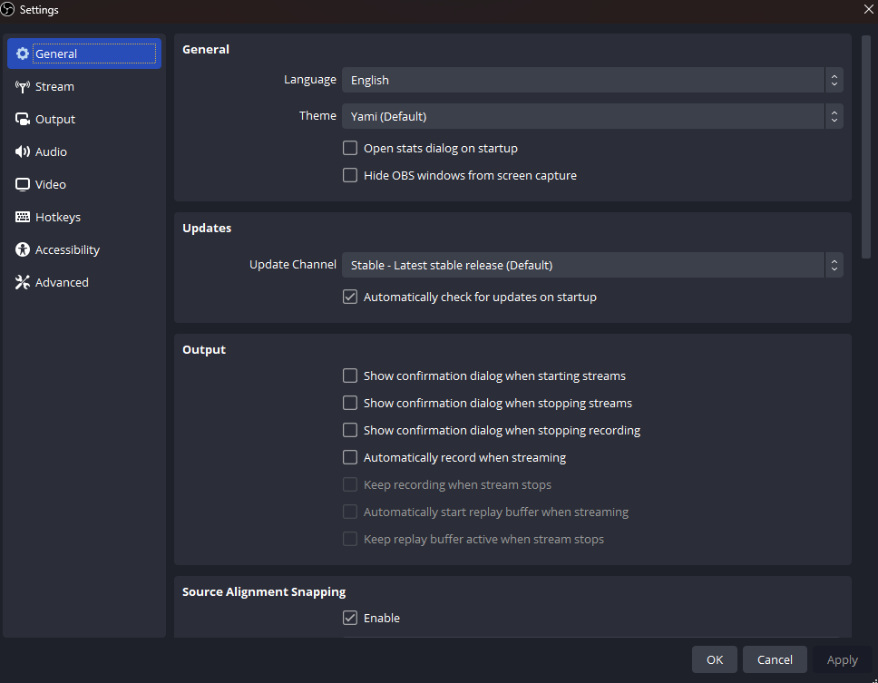

# Second Journal Entry...
Recording software is kind of its own beast when it comes to mental maps because most people don't use them. When I first installed OBS (Open Broadcast Software) I didn't know how to use it in the slightest, it had a record button but nothing was being recorded when I clicked it. Now after using it for a few years I expect any recording software to be the same as OBS with the same features. When I first opened the app there was nothing to tell me what I should do. here is a screenshot of what I found when I first opened the app:

To actually start recording you need to first add a capture source, a capture source is what is being recorded. You can select a specific window to be recorded or you can capture your whole screen as you see it. to add a capture source click the plus button under the sources tab at the bottom, once you do this popup will appear:

By clicking display capture you a popup window prompting you to name it and to select a display will show up:

Doing this adds a source that captures your whole screen as you see it. That is the most simple use of this app, however you can tweak many more settings to get the exact recording result you want:

However as a normal user the only settings screen you will end up using is the output screen to change the destination of the saved file once you are done recording:

On the output screen you have two parts, the streaming screen and the recording screen. The streaming screen is for the bitrate of the recorded video or the bitrate of the stream you are outputting if you want to use the software for live streaming. you can change the video encoder, which on a basic level is how your computer reads the video. This matters for people who want to live stream games because certain encoding methods can have lesser impacts on your system while gaming.
I enjoy this industry standard app and after years of using it I still havent used it to its fullest. the app is not very **learnable** because the advanced features are a bit confusing to use. If you want some good screen recording/streaming software I would highly recommend this software because it offers great video and audio quality and can output in almost any video format. My **mental model** for recording software has been built off of this app. The apps basic features are easy to commit to **memory** and the end result is **satisfying**. 
  

